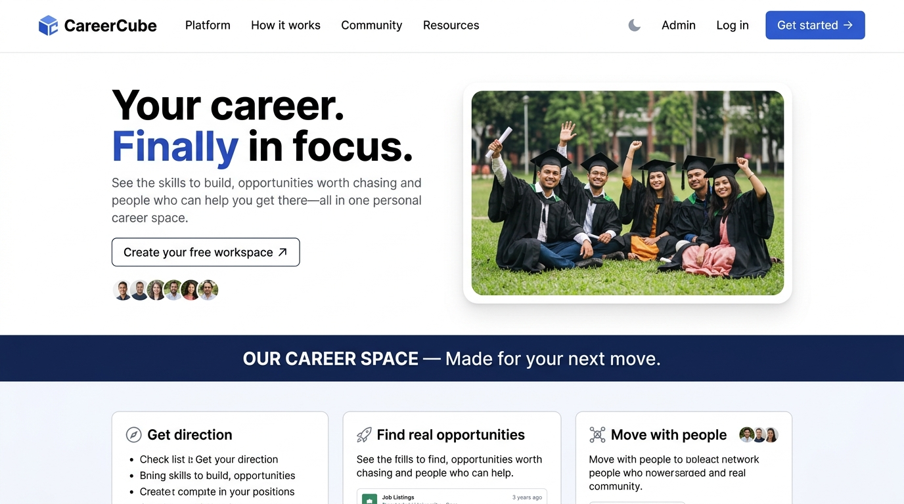
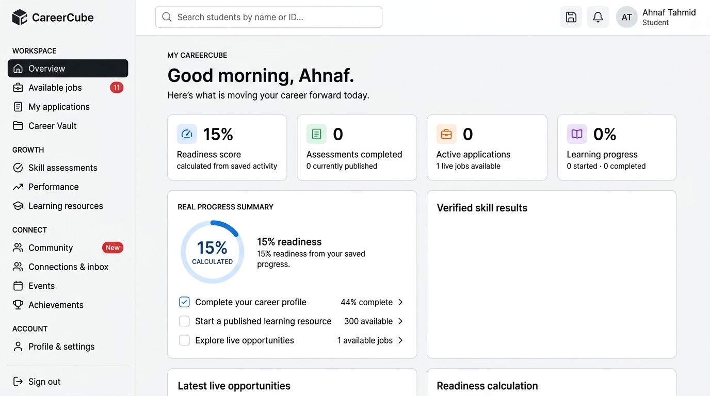
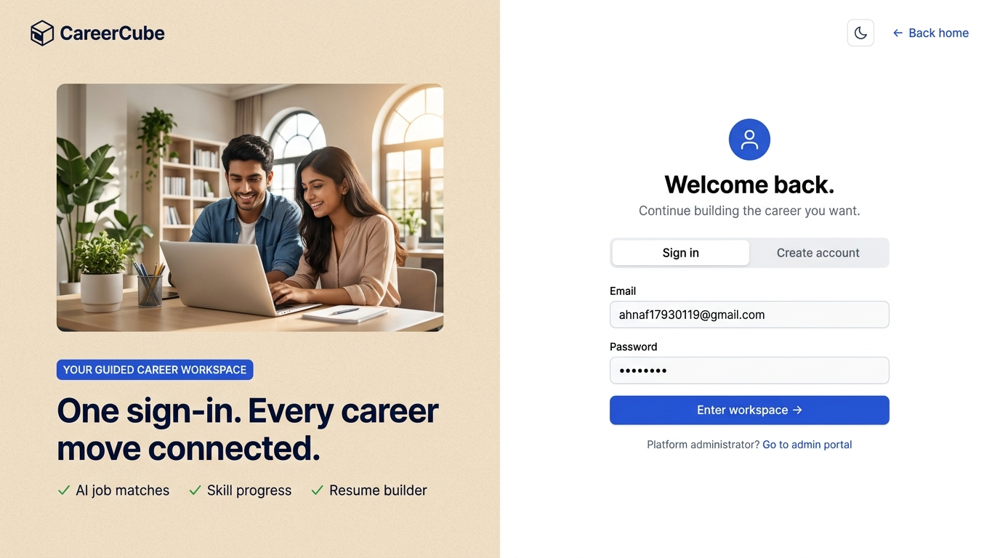

<div align="center">
  
  <h1>CareerCube</h1>
  <p><strong>AI-powered career development platform for university students in Bangladesh</strong></p>

  
  
  
  
  
  

  <br/>

  [](https://careerforge-ai-rose-eight.vercel.app/)
</div>

---

CareerCube is a full-stack, AI-enhanced career platform built specifically for university students in Bangladesh. It bridges the gap between campus and career — offering personalized job matching, AI-generated cover letters, adaptive skill assessments, curated learning resources, and a peer community — all wrapped in a premium dark-mode interface.

---

## 📸 Screenshots

### 🏠 Landing Page

*"Your career. Finally in focus." — Clean, minimal hero with real grad photo, feature cards, and one-click workspace creation.*

### 🎓 Student Dashboard

*Personalized workspace with career readiness score, real progress summary, live job opportunities, and skill verification.*

### 🔐 Sign In

*Split-screen auth — one sign-in for students, direct link to the admin portal. Email verification built in.*

---

## ✨ Features

### 🎓 Student Experience
| Feature | Description |
|---|---|
| **Personalized Dashboard** | Career readiness score, job matches, application count, and learning progress |
| **AI Job Matching** | Verified Bangladesh + remote jobs scored against your profile and skills |
| **Application Tracker** | Kanban-style pipeline from saved → applied → shortlisted → offer |
| **AI Cover Letters** | Gemini-powered cover letters generated from your resume and the job description |
| **Resume / Career Vault** | Upload, preview, and manage CV versions. Print-to-PDF export |
| **Learning Resources** | 12 curated courses/guides with real YouTube videos, progress tracking, and module curriculum |
| **Adaptive Assessments** | 10-level AI-generated quiz journeys tailored to your degree and target role |
| **Community** | Peer posts, likes, comments, and content reporting moderated by admins |
| **Connections** | Student networking with private messaging inbox |
| **Events** | Register for career fairs, workshops, and live sessions |
| **Analytics** | Weekly readiness trends, skill-gap charts, and assessment history |
| **Achievements** | Gamified milestones — Profile Pioneer, Skill Sprint, Interview Ready, and more |

### 🛠️ Admin Experience
| Feature | Description |
|---|---|
| **User Management** | View, activate, and manage student accounts |
| **Assessment Builder** | Create assessments with question banks and difficulty levels |
| **Resource Manager** | Publish learning resources with URLs, thumbnails, and difficulty tags |
| **Job Publisher** | Post internal and verified external job opportunities |
| **Events Manager** | Create and manage events with capacity controls |
| **Application Funnel** | Review all student applications and update statuses |
| **Community Moderation** | Handle reported posts and manage community health |
| **Performance Monitoring** | Platform-wide analytics and engagement metrics |
| **System Settings** | Control platform configuration and admin accounts |

---

## 🏗️ Tech Stack

```
Frontend        React 19, Vite 7, Tailwind CSS 3, Lucide Icons
Backend         Node.js 20+, Express 5, JWT, bcrypt, MySQL2
Database        MySQL 8.4 — normalized schema, seed data, migrations
AI              Google Gemini API (adaptive assessments, cover letters)
                Python 3.12 / FastAPI (job matching, skill-gap scoring)
Infrastructure  Docker Compose, Nginx, Vercel (serverless functions)
Email           Nodemailer + Gmail App Password / Resend
```

---

## 🚀 Quick Start (Docker)

The fastest way to run everything — frontend, API, AI service, and MySQL:

```bash
git clone https://github.com/iamahnaf/Career_Cube.git
cd Career_Cube
docker compose up --build
```

| Service | URL |
|---|---|
| Web (React) | http://localhost:3000 |
| Express API | http://localhost:4000/api/health |
| Python AI Docs | http://localhost:8000/docs |
| MySQL | localhost:3306 |

The first MySQL startup automatically applies `database/schema.sql` and `database/seed.sql`.

---

## 💻 Manual Development Setup

### Prerequisites
- Node.js ≥ 20
- MySQL 8.4 (e.g. XAMPP, local install)
- Python 3.12+ (for AI service, optional)

### 1 — Clone & Install

```bash
git clone https://github.com/iamahnaf/Career_Cube.git
cd Career_Cube
npm install
```

### 2 — Configure Environment

```bash
# Windows
copy .env.example .env

# macOS / Linux
cp .env.example .env
```

Open `.env` and fill in your values (see [Environment Variables](#environment-variables) below).

### 3 — Create the Database

```bash
# Apply schema
mysql -u root careerforge < database/schema.sql

# Apply seed data
mysql -u root careerforge < database/seed.sql

# Seed real learning resources
mysql -u root careerforge < database/seed_learning_resources.sql
```

### 4 — Create Admin Account

```bash
set ADMIN_NAME=Your Name
set ADMIN_EMAIL=admin@yourdomain.com
set ADMIN_PASSWORD=use-a-long-private-password
npm run admin:create
```

### 5 — Create a Student Account

```bash
node scripts/create-student.cjs
```

### 6 — Run the Dev Server

```bash
npm run dev:all
```

| Service | URL |
|---|---|
| Frontend | http://localhost:5173 |
| API | http://localhost:4000 |

### 7 — Run AI Service (Optional)

```bash
pip install -r ai-service/requirements.txt
uvicorn main:app --app-dir ai-service --reload --port 8000
```

---

## 🔐 Environment Variables

Copy `.env.example` to `.env` and fill in the following:

```bash
# Server
PORT=4000
JWT_SECRET=replace-with-a-long-random-string

# MySQL
MYSQL_HOST=127.0.0.1
MYSQL_PORT=3306
MYSQL_USER=root
MYSQL_PASSWORD=
MYSQL_DATABASE=careerforge
MYSQL_SSL=false

# Admin bootstrap (used once, then remove)
ADMIN_NAME=
ADMIN_EMAIL=
ADMIN_PASSWORD=

# Google Gemini AI (server-only, never use VITE_ prefix)
GEMINI_API_KEY=replace-with-your-gemini-api-key
GEMINI_MODEL=gemini-3.6-flash

# Email — Gmail App Password
EMAIL_PROVIDER=gmail
GMAIL_USER=your-email@gmail.com
GMAIL_APP_PASSWORD=your-16-char-app-password
EMAIL_FROM=CareerCube <your-email@gmail.com>
EMAIL_VERIFICATION_SECRET=replace-with-a-long-random-secret

# Email — Resend (alternative)
RESEND_API_KEY=

# Local dev: print codes to console instead of sending email
EMAIL_DELIVERY_MODE=console
```

> **Security:** Never commit real values. Never prefix secrets with `VITE_` — that exposes them to the browser bundle.

---

## 🗄️ Database Schema

The schema lives in [`database/schema.sql`](database/schema.sql) and covers:

```
users                     Core accounts (student / admin)
student_profiles          University, degree, target role, bio
jobs / external_job_*     Internal and external job listings
applications              Student applications with status pipeline
learning_resources        Curated courses, videos, guides
resource_progress         Per-student learning progress
assessments / questions   Adaptive quiz system
assessment_attempts       Student quiz history and scores
community_posts           Peer posts, likes, comments, reports
student_connections       Connection graph and private messages
events / event_reg*       Career events and seat management
achievements              Gamified milestones
```

---

## 🤖 AI Features

### Adaptive Skill Assessments (Gemini)
Students unlock 10 progressively harder quiz levels. Before starting, they must complete their profile (university, degree, graduation year, target role, career interests). Only the **degree, target role, and career interests** are sent to Gemini — account identity and contact details are never included in the generation prompt.

### Cover Letter Generation
One-click AI cover letters tailored to a specific job posting, generated from the student's saved resume content via the Gemini API.

### Python AI Service
A FastAPI microservice handles:
- Job–profile compatibility scoring
- Skill gap detection
- Career readiness calculation
- Resume profile extraction

---

## 🎓 Student Email Verification

Signup uses a **two-step email verification flow**:
1. Server sends a 6-digit code, stores only its HMAC hash
2. Code expires after 10 minutes
3. Student account is created only after successful verification

For local dev without a domain, use a **Gmail App Password**:
1. Enable 2-Step Verification on your Gmail account
2. Generate an App Password under Security → App passwords
3. Set `EMAIL_PROVIDER=gmail` and fill `GMAIL_USER` + `GMAIL_APP_PASSWORD`

For production, use [Resend](https://resend.com) with a verified domain.

---

## 📚 Learning Resources

CareerCube ships with **12 curated real resources** linking to YouTube videos and authoritative blogs:

| # | Title | Type | Source |
|---|---|---|---|
| 1 | SQL for Product Decisions | Video | YouTube |
| 2 | Write an ATS-ready Resume | Video | YouTube |
| 3 | Interview Stories that Stick | Video | YouTube |
| 4 | Product Analytics Field Guide | Blog | Mixpanel |
| 5 | React Patterns for Real Teams | Video | YouTube |
| 6 | Negotiating Your First Offer | Video | YouTube |
| 7 | System Design Interview Crash Course | Video | YouTube |
| 8 | Git & GitHub Workflows for Teams | Video | YouTube |
| 9 | Data Structures & Algorithms Roadmap | Video | YouTube |
| 10 | LinkedIn Profile Optimization Guide | Article | LinkedIn |
| 11 | Product Management Fundamentals | Video | YouTube |
| 12 | Freelancing & Remote Work Starter Kit | Article | HubSpot |

---

## 🧪 Verification Commands

```bash
# Build frontend
npm run build

# Check server syntax
node --check server/src/app.js

# Adaptive assessment smoke test
npm run test:adaptive-assessment

# Security audit (production deps only)
npm audit --omit=dev

# Python checks
python -m py_compile ai-service/main.py
python -m pip check
```

---

## 🚢 Deploying to Vercel

1. Connect a **TiDB Cloud** cluster — the integration automatically injects `TIDB_*` environment variables
2. Add a long random `JWT_SECRET` in Vercel's environment settings
3. Run migrations on the remote database:

```bash
npm run db:setup
npm run admin:create
```

The Vercel serverless function in [`api/index.js`](api/index.js) serves the Express API on the same origin as the React frontend.

---

## 📁 Project Structure

```
Career_Cube/
├── api/                    # Vercel serverless entry point
├── ai-service/             # Python FastAPI microservice
├── components/
│   ├── admin/              # Admin workspace components
│   ├── public/             # Landing page components
│   └── student/            # Student dashboard components
├── database/
│   ├── schema.sql          # Full MySQL schema
│   ├── seed.sql            # Initial seed data
│   └── seed_learning_resources.sql  # Learning resources with real URLs
├── lib/
│   ├── api.js              # Frontend API client
│   ├── learningCurriculum.js  # Module curricula with external URLs
│   ├── mockData.js         # Fallback/demo data
│   └── router.jsx          # Client-side routing
├── public/                 # Static assets and hero images
├── scripts/                # Admin/student bootstrap scripts
├── server/
│   └── src/
│       ├── config/         # DB connection
│       ├── middleware/      # Auth, error handling
│       ├── routes/         # Express route handlers
│       └── services/       # Business logic services
├── src/
│   ├── index.css           # Global design tokens
│   ├── landing.css         # Landing page styles
│   └── main.jsx            # React entry point
├── .env.example            # Environment variable template
├── docker-compose.yml      # Multi-service Docker setup
└── vite.config.js          # Vite bundler config
```

---

## 👥 Contributors

| Member | Contribution |
|---|---|
| **Ahnaf** | Platform architecture, student dashboard, learning resources, job matching, AI integration, admin panel |
| **Shefin-z (Member 05)** | Student connections, private inbox messaging, community interactions, reporting, and administrator moderation |

---

## 📄 License

This project is open source under the [MIT License](LICENSE).

---

<div align="center">
  <p>Built with ❤️ at <strong>United International University</strong>, Bangladesh</p>
  <p>
    <a href="https://github.com/iamahnaf/Career_Cube">GitHub</a> ·
    <a href="https://github.com/iamahnaf/Career_Cube/issues">Report Bug</a> ·
    <a href="https://github.com/iamahnaf/Career_Cube/issues">Request Feature</a>
  </p>
</div>
